<div align="center">


<a href="https://git.io/typing-svg">
  
</a>

<br/>


<!--  -->


<br/><br/>

<a href="https://github.com/AbhilashSomigari?tab=repositories">
  
</a>
<a href="https://www.linkedin.com/in/abhilashreddysomigari">
  
</a>
<a href="mailto:as00391@mix.wvu.edu">
  
</a>
<a href="https://github.com/AbhilashSomigari">
  
</a>

<br/><br/>


<a href="https://github.com/AbhilashSomigari?tab=followers">
  
</a>
<a href="https://github.com/AbhilashSomigari?tab=repositories">
  
</a>

</div>

---

## About

I am a **Software Engineer and AI/ML researcher** pursuing an M.S. in Computer Science at West Virginia University. I build scalable backend systems, intelligent applications, and full-stack platforms that move ideas from research prototypes to reliable engineering products.

My work sits at the intersection of **software architecture, artificial intelligence, computer vision, agentic systems, and product engineering**. I focus on designing maintainable systems with measurable performance, reproducible workflows, intuitive interfaces, and clear business or research impact.

I have hands-on experience developing **AI infrastructure, cloud-based data pipelines, explainable deep-learning systems, multi-agent applications, developer tooling, and production-oriented web platforms**. My engineering approach combines rigorous problem solving with a product mindset: understand the user, define the system boundaries, measure the outcome, and continuously improve reliability.

### Open To

> **Software Engineering · AI/ML Engineering · Full-Stack Engineering · Applied AI · Research Engineering · Open-Source Collaboration**

---

## Tech Stack

<div align="center">

### Languages


<br/>


### Frontend


<br/>


### Backend & Databases


<br/>


### Cloud, DevOps & Tooling


<br/>


</div>

---

## AI / ML Expertise

| Domain                             | Proficiency | Details                                                                                              |
| :--------------------------------- | :---------: | :--------------------------------------------------------------------------------------------------- |
| **Machine Learning**               |   Advanced  | Supervised learning, model evaluation, feature engineering, experimental design, scikit-learn        |
| **Deep Learning**                  |   Advanced  | PyTorch, TensorFlow, CNN architectures, transfer learning, training and optimization workflows       |
| **Computer Vision**                |   Advanced  | Object detection, image segmentation, video analysis, YOLOv5, OpenCV, SAM3                           |
| **Explainable AI**                 |   Advanced  | Grad-CAM, EigenCAM, attribution analysis, localization metrics, explanation faithfulness             |
| **Agentic AI**                     |   Advanced  | LangGraph, LangChain, CrewAI, Agno, multi-agent orchestration, tool-using agents                     |
| **Retrieval-Augmented Generation** |   Advanced  | Debate-based RAG, evidence retrieval, citation validation, judge synthesis, local LLM workflows      |
| **AI Evaluation**                  |    Strong   | Quantitative evaluation frameworks, hallucination reduction, evidence coverage, reliability analysis |
| **ML Infrastructure**              |    Strong   | Reproducible pipelines, experiment automation, dataset processing, deployment-oriented workflows     |
| **Spatiotemporal Analytics**       |    Strong   | NOAA and GOES-16 datasets, weather-data pipelines, cloud analytics, structured ML tasks              |
| **Applied Medical AI**             |    Strong   | Surgical-video segmentation, anatomical-region analysis, normalization, quantitative outcome metrics |

---

## Featured Projects

<details>
<summary><strong>Multi-Agent Debate RAG System</strong></summary>

<br/>

A reliability-focused retrieval-augmented generation platform in which independent AI agents construct, challenge, verify, and synthesize evidence-backed answers.

| Category        | Details                                                                                                                        |
| :-------------- | :----------------------------------------------------------------------------------------------------------------------------- |
| **Stack**       | Python, LangGraph, Ollama, RAG, local LLMs, vector retrieval, citation verification                                            |
| **Scale**       | Multi-agent workflow with independent reasoning, cross-examination, evidence validation, and judge synthesis                   |
| **Performance** | Reduced weakly grounded or hallucinated responses by **45%** and improved answer completeness and evidence coverage by **30%** |
| **Security**    | Local-first inference, controlled tool execution, evidence gating, and mandatory citation validation                           |
| **Impact**      | Enforced **100% citation coverage** for factual claims and removed uncited statements from final responses                     |
| **Repository**  | [Explore the project repositories](https://github.com/AbhilashSomigari?tab=repositories&q=RAG)                                 |

The system replaces a single-pass generation workflow with a structured engineering pipeline. Multiple agents independently analyze retrieved evidence, challenge unsupported conclusions, and submit their findings to a judge agent. A final verification layer checks citation coverage before an answer is released.

</details>

<br/>

<details>
<summary><strong>Explainable Object Detection Platform</strong></summary>

<br/>

An end-to-end computer-vision and explainability platform for training object detectors, generating attribution maps, and quantitatively evaluating explanation quality.

| Category        | Details                                                                                                                    |
| :-------------- | :------------------------------------------------------------------------------------------------------------------------- |
| **Stack**       | Python, PyTorch, YOLOv5, Grad-CAM, EigenCAM, OpenCV, Flask, React                                                          |
| **Scale**       | Multi-class, hand-labeled satellite-image dataset with automated model, explanation, and evaluation pipelines              |
| **Performance** | Reduced manual heatmap inspection by **70%** and experiment execution and iteration time by **50%**                        |
| **Security**    | Validated input handling, deterministic artifact organization, isolated experiment outputs, and reproducible configuration |
| **Impact**      | Designed a quantitative Q-metric for faster identification of faithful and trustworthy explanation methods                 |
| **Repository**  | [Explore the computer-vision repositories](https://github.com/AbhilashSomigari?tab=repositories&q=YOLO)                    |

The platform integrates object detection, explanation generation, quantitative scoring, and a full-stack interface into one workflow. Researchers can run experiments, inspect predictions, compare explanation methods, and analyze evaluation results without repeatedly executing disconnected scripts.

</details>

<br/>

<details>
<summary><strong>Surgical Video Analysis System</strong></summary>

<br/>

A medical-video analysis pipeline for quantitatively studying gastric resection patterns in laparoscopic sleeve gastrectomy procedures.

| Category        | Details                                                                                                                         |
| :-------------- | :------------------------------------------------------------------------------------------------------------------------------ |
| **Stack**       | Python, SAM3, OpenCV, NumPy, image segmentation, video analytics                                                                |
| **Scale**       | Processed **20 laparoscopic sleeve gastrectomy videos** with anatomical-region and surgeon-wise analysis                        |
| **Performance** | Improved cross-frame pixel-comparison reliability by **30%** using scaling-based normalization                                  |
| **Security**    | Controlled offline processing, structured case-level artifacts, reproducible segmentation, and de-identified analytical outputs |
| **Impact**      | Reduced manual evaluation effort by **40%** and enabled objective cut-ratio measurement across surgical cases                   |
| **Repository**  | [Explore the medical-AI repositories](https://github.com/AbhilashSomigari?tab=repositories&q=surgical)                          |

The system segments reference, cut, and uncut anatomical regions from surgical video frames. A scaling-based normalization method addresses inconsistencies between frames, enabling more reliable quantitative comparisons and surgeon-level analysis.

</details>

<!-- <br/>

<details>
<summary><strong>BrainNet — Explainable Hemorrhage Detection</strong></summary>

<br/>

A deep-learning application for detecting intracranial hemorrhage patterns in CT imaging while providing interpretable visual evidence for model predictions.

| Category        | Details                                                                                                             |
| :-------------- | :------------------------------------------------------------------------------------------------------------------ |
| **Stack**       | Python, TensorFlow, ResNet50, VGG16, OpenCV, Grad-CAM                                                               |
| **Scale**       | Hybrid convolutional architecture with end-to-end preprocessing, classification, and explanation workflows          |
| **Performance** | Combined complementary pretrained feature extractors to strengthen representation quality                           |
| **Security**    | Offline image processing, controlled model inputs, reproducible preprocessing, and interpretable prediction outputs |
| **Impact**      | Added visual explanation maps to make medical-image classifications easier to inspect and evaluate                  |
| **Repository**  | [Explore the deep-learning repositories](https://github.com/AbhilashSomigari?tab=repositories&q=BrainNet)           |

BrainNet combines transfer learning and visual explainability to move beyond black-box prediction. The system generates Grad-CAM visualizations that highlight the image regions contributing most strongly to each classification result.

</details> -->

<br/>

<details>
<summary><strong>Face Recognition Attendance Platform</strong></summary>

<br/>

An automated attendance platform that recognizes registered individuals, records attendance events, and generates structured daily reports.

| Category        | Details                                                                                                       |
| :-------------- | :------------------------------------------------------------------------------------------------------------ |
| **Stack**       | Python, OpenCV, face-recognition, CSV automation, PDF reporting                                               |
| **Scale**       | End-to-end enrollment, recognition, attendance logging, and report-generation workflow                        |
| **Performance** | Replaced repetitive manual attendance entry with automated recognition and report generation                  |
| **Security**    | Controlled enrollment, local biometric processing, structured identity records, and restricted report outputs |
| **Impact**      | Delivered a complete solo-engineered application from recognition logic to administrative reporting           |
| **Repository**  | [Explore the automation repositories](https://github.com/AbhilashSomigari?tab=repositories&q=attendance)      |

The project combines computer vision with workflow automation. It captures recognized identities, prevents duplicate attendance entries, stores daily records, and produces exportable CSV and PDF reports for administrative use.

</details>

---

## Experience

### Teaching Assistant · Data-Driven West Virginia

**Cloud Analytics and NOAA Data**
`January 2026 — Present`

Support the design and delivery of engineering projects involving cloud analytics, weather data, machine learning, and reproducible data workflows.

* Prepared and structured NOAA and GOES-16 datasets and project pipelines, reducing student setup time by **30%**.
* Designed scalable data workflows and spatiotemporal machine-learning tasks, improving evaluation consistency by **25%**.
* Developed starter code, technical documentation, and debugging guides, improving project quality and submission success by **35%**.
* Helped students translate analytical requirements into maintainable, testable, and reproducible implementations.


<br/>

### Graduate Research Assistant · West Virginia University

**AI, Machine Learning and Deep Learning**
`August 2025 — Present`

Engineer applied AI systems spanning computer vision, explainable AI, full-stack research platforms, and quantitative medical-video analysis.

* Built end-to-end YOLOv5 object-detection and explainability pipelines using a multi-class, hand-labeled satellite-image dataset.
* Designed a quantitative XAI evaluation metric that reduced manual heatmap inspection by **70%**.
* Developed a full-stack experiment platform that reduced execution and iteration time by **50%**.
* Built a SAM3-based surgical-video segmentation pipeline across **20 procedures**.
* Designed normalization and cut-ratio analysis methods for more reliable cross-frame and surgeon-wise evaluation.
* Converted research workflows into measurable, repeatable, and developer-friendly engineering systems.


<br/>

<!-- ### Instructor & Mentor · Smart Interviews

`January 2024 — May 2024`

Delivered structured data-structures and algorithms instruction while mentoring students through coding exercises and technical-assessment preparation.

* Taught arrays, strings, linked lists, stacks, queues, trees, and hash tables to **80+ students**.
* Conducted doubt-solving sessions, coding practice, and technical-assessment preparation.
* Provided continuous feedback to improve problem-solving ability, implementation quality, and interview readiness.
* Translated complex algorithmic concepts into clear explanations and practical coding patterns.


--- -->

## Achievements

|           Recognition          | Details                                                                                                                        |
| :----------------------------: | :----------------------------------------------------------------------------------------------------------------------------- |
|     **Academic Excellence**    | Maintained a **3.87 GPA** while completing graduate coursework in Agentic AI, Pattern Recognition, Deep Learning, and Big Data |
| **AI Reliability Engineering** | Reduced weakly grounded or hallucinated RAG responses by **45%** through multi-agent debate and verification                   |
|     **Citation Integrity**     | Designed an automated validation pipeline that achieved **100% citation coverage** for factual AI-generated claims             |
|  **Explainability Innovation** | Developed a quantitative XAI metric that reduced manual heatmap inspection by **70%**                                          |
| **Product Engineering Impact** | Built a full-stack research platform that reduced experiment execution and iteration time by **50%**                           |
|     **Medical AI Research**    | Developed a segmentation and normalization pipeline for quantitative analysis of **20 surgical videos**                        |
|    **Engineering Education**   | Taught core data structures and algorithms to a cohort of **80+ students**                                                     |
|    **Developer Enablement**    | Produced datasets, starter code, documentation, and debugging workflows that improved student project success                  |

---

## Certifications

### AWS

<a href="https://aws.amazon.com/certification/">
  
</a>

### Oracle

<a href="https://education.oracle.com/oracle-certification-path/pFamily_48">
  
</a>

### NPTEL

<a href="https://nptel.ac.in/">
  
</a>

### Cisco

<a href="https://www.netacad.com/">
  
</a>

### IBM

<a href="https://www.coursera.org/professional-certificates/ibm-rag-and-agentic-ai">
  
</a>

---

## Coding Profiles

<div align="center">

<a href="https://leetcode.com/u/ab_reddy27/">
  
</a>

<!-- <a href="https://www.geeksforgeeks.org/user/AbhilashSomigari/">
  
</a> -->

<!-- <br/><br/> -->

<a href="https://www.hackerrank.com/profile/abhilashreddy027">
  
</a>

<a href="https://www.codechef.com/users/ab_reddy27">
  
</a>

<a href="https://codeforces.com/profile/ab_reddy27">
  
</a>

<a href="https://www.spoj.com/users/ab_reddy27/">
  
</a>
</div>

<!-- --- -->

<!-- ## GitHub Analytics

<div align="center">


<br/>


</div> -->

<!-- --- -->

<!-- ## GitHub Trophies

<div align="center">


</div> -->

---

## Contribution Activity

<div align="center">



</div>

---

## Contribution Snake

<div align="center">

<picture>
  <source
    media="(prefers-color-scheme: dark)"
    srcset="https://raw.githubusercontent.com/AbhilashSomigari/AbhilashSomigari/output/github-contribution-grid-snake-dark.svg"
  />
  <source
    media="(prefers-color-scheme: light)"
    srcset="https://raw.githubusercontent.com/AbhilashSomigari/AbhilashSomigari/output/github-contribution-grid-snake.svg"
  />
  
</picture>

</div>

---

## Current Focus

```yaml
learning:
  - Production-grade agentic AI architecture
  - Distributed systems and scalable backend design
  - Reliable evaluation for generative AI systems
  - Cloud-native machine learning infrastructure

building:
  - Evidence-grounded multi-agent applications
  - Explainable computer-vision platforms
  - Full-stack AI research tools
  - Reproducible data and experimentation pipelines

exploring:
  - AI agents with structured tool execution
  - Multimodal and medical AI systems
  - Model reliability, safety, and observability
  - Open-source developer infrastructure

open_to:
  - Software Engineer opportunities
  - AI and Machine Learning Engineer roles
  - Full-Stack Product Engineering roles
  - Applied AI and Research Engineering collaborations
```

---

## Connect

<div align="center">

<a href="mailto:abhilashreddysomigari@gmail.com">
  
</a>

<a href="https://www.linkedin.com/in/abhilashreddysomigari">
  
</a>

<br/><br/>

<a href="https://github.com/AbhilashSomigari">
  
</a>

<a href="https://github.com/AbhilashSomigari?tab=repositories">
  
</a>

</div>

---

<div align="center">

### “Engineering is the discipline of turning ambiguity into reliable, scalable systems.”


</div>
